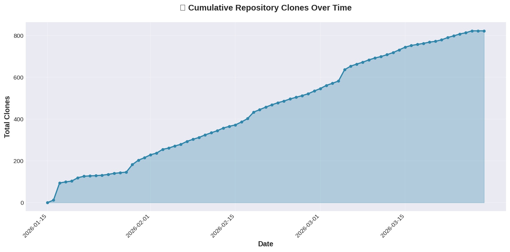
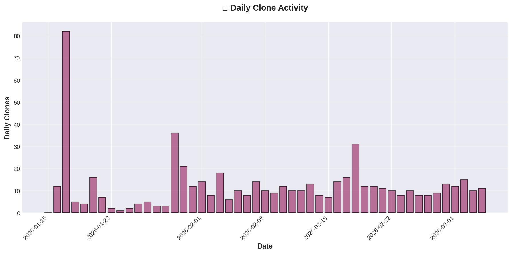
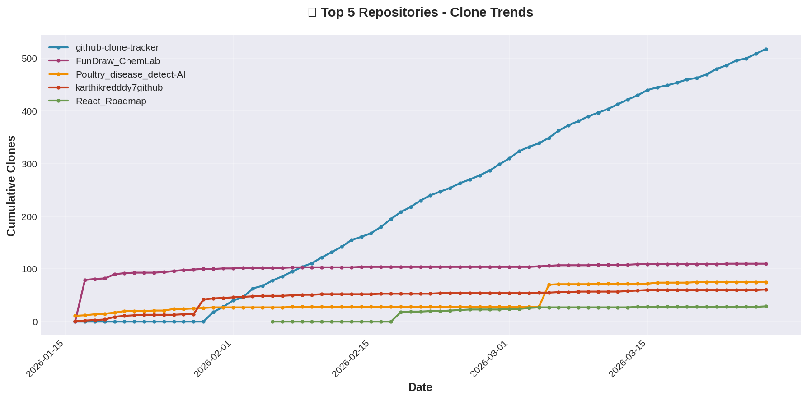

# 📊 GitHub Clone Tracker

**Automated clone statistics tracking for all your GitHub repositories, running entirely on GitHub Actions.**

This system automatically tracks clone counts and unique cloners across all your repositories over time, storing historical data beyond GitHub's 14-day limit. All data collection and visualization happens automatically on GitHub - no local setup required!

---

## 🌟 Features

- ✅ **Fully Automated**: Runs daily via GitHub Actions
- 📈 **Historical Tracking**: Keeps clone data indefinitely (beyond GitHub's 14-day window)
- 📊 **Beautiful Visualizations**: Auto-generated graphs and charts
- 🔄 **Incremental Updates**: Only fetches new data, preserves history
- 🎯 **All Repositories**: Tracks all your repos in one place .
- 📱 **View Anytime**: Just check this repository to see your stats!

---

## 📈 Current Statistics








### 📝 Detailed Stats

[View Full Statistics Summary](graphs/STATS_SUMMARY.md)

---

## 🚀 Quick Start

### 1. Create a GitHub Personal Access Token

1. Go to GitHub Settings → Developer settings → [Personal access tokens](https://github.com/settings/tokens)
2. Click **"Generate new token (classic)"**
3. Give it a descriptive name (e.g., "Clone Tracker")
4. Select the following scopes:
   - ✅ `repo` (Full control of private repositories) - needed to access clone traffic data
5. Click **"Generate token"**
6. **Copy the token immediately** (you won't be able to see it again!)

### 2. Set Up This Repository

1. **Fork or create this repository** in your GitHub account
2. Go to repository **Settings → Secrets and variables → Actions**
3. Click **"New repository secret"**
4. Add a secret named: `CLONE_TRACKER_TOKEN`
5. Paste your GitHub personal access token as the value
6. Click **"Add secret"**

### 3. Enable GitHub Actions

1. Go to the **Actions** tab in your repository
2. If prompted, click **"I understand my workflows, go ahead and enable them"**
3. The workflow will now run automatically every day at midnight UTC

### 4. Trigger the First Run (Optional)

To see results immediately without waiting for the scheduled run:

1. Go to **Actions** tab
2. Click on **"Track Clone Statistics"** workflow
3. Click **"Run workflow"** → **"Run workflow"**
4. Wait a minute for it to complete
5. Check the graphs in the `graphs/` directory or view them in this README!

---

## 📅 How It Works

1. **Daily Schedule**: GitHub Actions runs the tracker every day at 00:00 UTC
2. **Data Collection**: The script fetches clone statistics for all your repositories
3. **Data Storage**: Results are saved to `clone_data.json` with historical data preserved
4. **Visualization**: Graphs are automatically generated and saved to `graphs/`
5. **Auto-Commit**: All changes are committed back to this repository
6. **View Results**: Simply visit this repository to see your updated statistics!

---

## 📂 Repository Structure

```
github-clone-tracker/
├── .github/
│   └── workflows/
│       └── track-clones.yml      # GitHub Actions workflow
├── graphs/                        # Generated visualizations
│   ├── cumulative_clones.png
│   ├── daily_activity.png
│   ├── repository_breakdown.png
│   ├── repository_trends.png
│   └── STATS_SUMMARY.md
├── clone_data.json                # Historical clone data (auto-generated)
├── github_clone_tracker.py        # Main tracking script
├── visualizer.py                  # Visualization generator
├── requirements.txt               # Python dependencies
└── README.md                      # This file
```

---

## ⚙️ Configuration

### Change Schedule

Edit `.github/workflows/track-clones.yml` to change when the tracker runs:

```yaml
on:
  schedule:
    - cron: '0 0 * * *'  # Daily at midnight UTC
```

Cron examples:
- `'0 */6 * * *'` - Every 6 hours
- `'0 0 * * 0'` - Every Sunday at midnight
- `'0 12 * * *'` - Every day at noon UTC

### Manual Runs

You can always manually trigger the workflow:
1. Go to **Actions** → **Track Clone Statistics**
2. Click **"Run workflow"**

---

## 📊 Data Format

The `clone_data.json` file stores data in the following format:

```json
{
  "repositories": {
    "repo-name": {
      "daily_clones": {
        "2026-01-30": {
          "count": 10,
          "uniques": 5
        }
      }
    }
  },
  "cumulative": {
    "2026-01-30": {
      "total_clones": 10,
      "daily_clones": 10
    }
  },
  "last_updated": "2026-01-30T12:00:00"
}
```

---

## 🔒 Privacy & Security

- **Token Security**: Your GitHub token is stored as a repository secret and never exposed
- **Data Privacy**: All data stays in your repository
- **No External Services**: Everything runs on GitHub's infrastructure
- **Open Source**: All code is visible and auditable

---

## ⚠️ Important Notes

- **14-Day Window**: GitHub API only provides the last 14 days of clone data. This tracker preserves historical data by running regularly.
- **API Rate Limits**: GitHub allows 5,000 API requests/hour for authenticated users. This is more than sufficient for tracking even hundreds of repositories.
- **Run Frequency**: Run at least once every 14 days to avoid losing data!

---

## 🛠️ Troubleshooting

### No graphs appearing?

1. Check the **Actions** tab for workflow runs
2. Look for any error messages in the workflow logs
3. Verify your `CLONE_TRACKER_TOKEN` secret is set correctly

### "Error: GITHUB_TOKEN environment variable not set"?

Make sure you've added `CLONE_TRACKER_TOKEN` to your repository secrets (not as an environment variable).

### No clone data showing?

- Clone statistics are only available for repositories you own
- Private repositories require the `repo` scope on your token
- Some repositories might not have any clones yet

---

## 📜 License

MIT License - Feel free to use and modify for your own tracking needs!

---

## 🙏 Credits

Built with:
- Python
- GitHub Actions
- Matplotlib
- GitHub REST API

---

**Happy Tracking! 📊✨**
